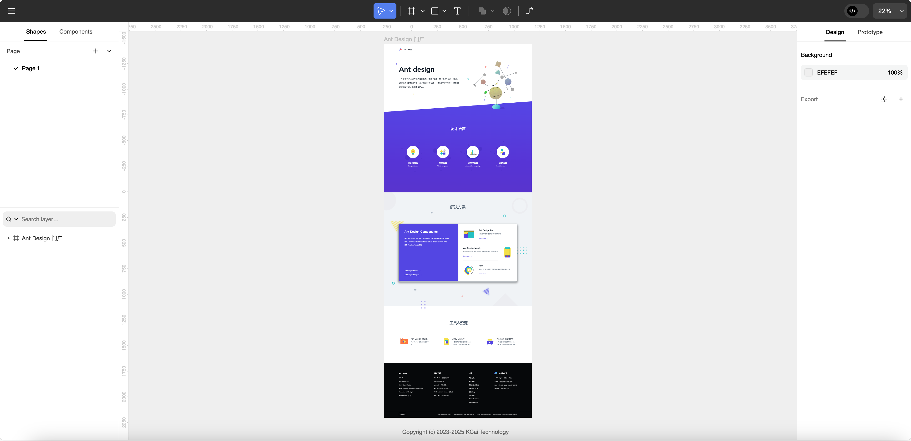

# vextra editor



## 项目简介
一款面向设计稿解析与编辑的可视化编辑器，支持多种设计文件格式（如 Figma、Sketch 等），可用于二次开发、设计稿预览、属性编辑、批量导出等场景。适用于设计工具开发、在线协作、自动化设计稿处理等需求。

## 主要特性
- 支持多种设计文件格式的解析与渲染
- 丰富的属性面板与图层操作
- 组件化、可扩展的前端架构
- 支持批量切图、导出、自动布局等高级功能
- 良好的本地开发与二次开发支持

## 安装

```bash
npm i @vextra/editor
```

## 快速开始

```ts
import { openDocument } from '@vextra/editor';

const result = await openDocument({
  // 传入你的文档参数
  ...props
});
```

> 你也可以参考 `client/Client.vue` 作为使用示例。


## 本地开发

#### 启动client界面

```bash
cd client
npm install
npm run client

# 打开samples目录文件
```

### lib开发

```bash
npm install
npm run dev
```

## License

This project is licensed under the AGPL-3.0 License - see the [LICENSE](LICENSE.txt) file for details.

## Author

- [KCai Technology](https://kcaitech.com)
- [Vextra Official Website](https://vextra.cn)
