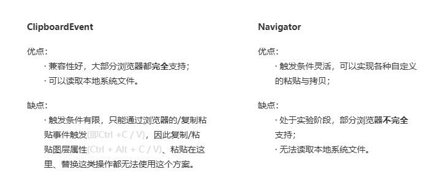

# MossClipboard

浏览器内常用两种方式读写剪切板的内容，分别为ClipboardEvent方式、Navigator方式：
   
可见，两种方式都有自己的短板，而彼此之间可以弥补这种短板，所以MossClipboard将两种方案做了融合。

## Ctrl+V粘贴
粘贴之前，会从剪切板中读取以下几种内容：  
· 图层；  
· 文本段落；  
· 纯文本；  
· 图片资源；  
· SVG矢量图；  
针对不一样的内容分别执行，详细见执行方案表；